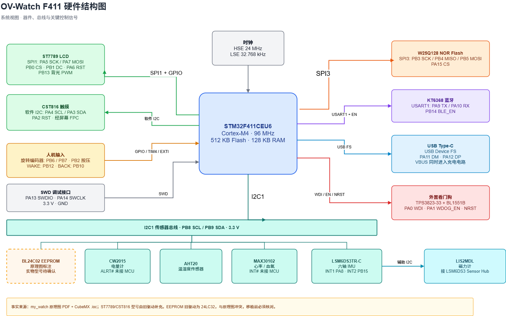
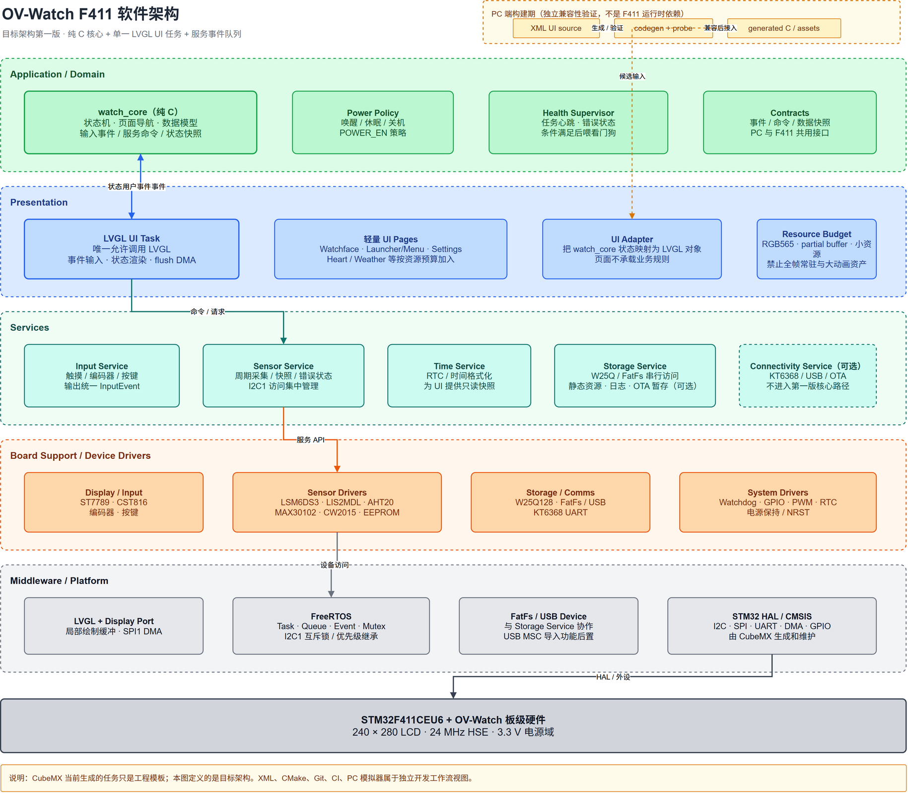

# Magic Watch Workflow

A CMake-first embedded watch workflow for STM32F411 and ESP32-S3, with reproducible builds, architecture diagrams, and incremental validation.

本仓库首先用于跑通嵌入式开发工作流：CMake + Ninja、板级工程隔离、Git 小提交、架构文档，以及后续的主机测试和 CI。它不是最终的双芯片手表产品仓库。

## Current status

- STM32F411 工程已经通过 CMake/Ninja 编译，并可使用 ST-Link 烧录。
- F411 当前验收目标是通过 ST7789 SPI1 DMA 显示 240x280 LVGL 代表页面。
- ESP32-S3 工程已经通过 ESP-IDF 点亮板载 RGB LED，并保留 UART 监视入口。
- CubeMX 生成区与手写 `user/` 代码已经分开；CubeMX 强制保留的 `defaultTask` 不承载手表业务。
- 纯 C `watch_core`、输入归一化模块、主机 CTest、固定 LVGL 9.5 UI 端口和 M7 PC 模拟器已加入；XML UI 由 LVGL Pro Editor 手动维护并提交生成 C，不依赖 Pro CLI。
- [F411 rolling development status](docs/f411-development-status.md)

## Documentation

### Hardware

- [F411 schematic / PCB design reference PDF](<firmware/stm32/f411_watch/docs/hardware/my_watch原理图_V2.0.pdf>)
- [Hardware block diagram source](firmware/stm32/f411_watch/docs/hardware/hardware-block-diagram.drawio)
- [Hardware system diagram](firmware/stm32/f411_watch/docs/hardware/hardware-block-diagram-系统结构图.drawio.png)
- [Power tree diagram](firmware/stm32/f411_watch/docs/hardware/hardware-block-diagram-电源树.drawio.png)



### Software

- [Software architecture source](firmware/stm32/f411_watch/docs/architecture/software-architecture.drawio)
- [Layered architecture](firmware/stm32/f411_watch/docs/architecture/software-architecture-分层架构.png)
- [Runtime tasks and events](firmware/stm32/f411_watch/docs/architecture/software-architecture-任务与事件.png)
- [Project layout and dependency rules](docs/project-layout.md)
- [M7 Editor export contract](docs/f411-m7-editor-export.md)



### Coding and formatting

- [C/C++ coding guidelines](docs/coding-guidelines.md)
- The root `.clang-format` is a project-level configuration for hand-written code.
- Automatic formatting is limited to the explicit F411 `user/`, shared `products/f411_watch/core/`, and `products/f411_watch/input/` whitelists; CubeMX-generated and third-party code is excluded.

## Build

### STM32F411

Open `firmware/stm32/f411_watch` in a terminal or use the VS Code tasks:

```sh
cmake --preset Debug
cmake --build --preset Debug
```

The generated App ELF is written to `build/Debug/my_watch_f411.elf`; the standalone Bootloader ELF is written to `build/Debug/f411_bootloader.elf`. VS Code provides build, signed-package, and OpenOCD/ST-Link tasks. OpenOCD is the supported F411 programming path.

### Host core tests

```sh
cmake -S tests -B build/host-tests -G Ninja
cmake --build build/host-tests
ctest --test-dir build/host-tests --output-on-failure
```

### F411 Editor UI simulator

```sh
cmake -S products/f411_watch/simulator -B build/host-m7 -G Ninja
cmake --build build/host-m7
ctest --test-dir build/host-m7 --output-on-failure
```

On Windows, run `build/host-m7/watch_ui_simulator.exe` for the 240x280 LVGL
window, or pass `--smoke` for the headless CTest path. The simulator builds the
committed generated C and never regenerates XML in CI.

Signed-package tasks read the external ECDSA private key and signed metadata from
machine-local user environment variables, so no path or release value is stored
in Git. In PowerShell, run this once with your own key path, then restart VS Code
so its task process inherits the variables:

```powershell
[Environment]::SetEnvironmentVariable("F411_SIGNING_KEY", "<path-to-f411-signing-key.pem>", "User")
[Environment]::SetEnvironmentVariable("F411_FIRMWARE_VERSION", "1", "User")
[Environment]::SetEnvironmentVariable("F411_SECURITY_COUNTER", "1", "User")
```

The OpenOCD tasks use `reset init` and verify each written image. When the
firmware changes, update the version and security counter before flashing; the
counter is signed metadata and must not be lowered for a later OTA release.

### ESP32-S3

Set `IDF_TOOLS_PATH` when ESP-IDF is not installed in the default local location, then run the VS Code ESP32-S3 build or flash task. The serial port is requested by the task instead of being fixed in the repository.

## CI

The initial GitHub Actions workflow protects only the F411 project. Pull requests, pushes to `main`, and manual runs classify changed paths first. F411 firmware, its Dockerfile, the formatting policy, or the workflow runs a pinned-image format-check, Debug build, and Cppcheck target; documentation-only changes skip the board job but still finish with `CI / CI Gate`.

The repository variable `F411_CI_IMAGE` must contain the Docker Hub image reference with its immutable digest, for example `docker.io/enen001/magic-watch-f411-ci@sha256:<digest>`. The workflow intentionally rejects `latest` and tag-only references.

## Working rules

- Read [CONTRIBUTING.md](CONTRIBUTING.md) before contributing. AI coding agents should also read [AGENTS.md](AGENTS.md).
- The required delivery flow is `branch -> code change -> Build + Cppcheck -> commit -> push -> pull request -> CI Gate -> Rebase and merge or rework`.
- Keep generated CubeMX files inside their generated boundary. Add hand-written sources through the top-level CMake entry and `user/CMakeLists.txt`.
- Make one focused change per commit.
- A commit should build the affected board target.
- Use the commit format `<type>:<scope>:<description>`, for example:
  `build:f411:connect hand-written user target`
  `docs:hardware:add f411 block diagrams`
  `fix:display:preserve power latch before gpio init`
- `learn/` is local study material and is intentionally excluded from Git.

## License

Original project code and documentation are released under the MIT License. STM32 vendor code, FreeRTOS, FatFs, USB middleware, ESP-IDF components, and other third-party materials retain their own licenses; see [THIRD_PARTY_NOTICES.md](THIRD_PARTY_NOTICES.md) and the license files in their directories.
